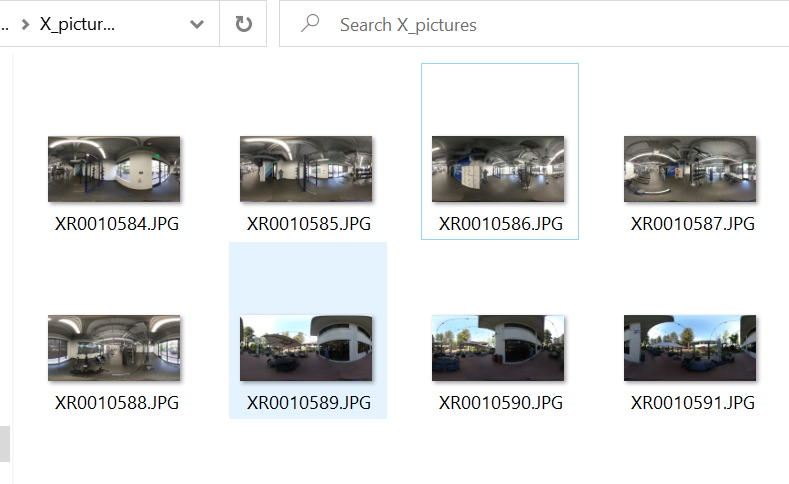

# RICOH THETA X Virtual Tour Taken with Timeshift 

Indoor and outdoor virtual tour demo made with the open source software 
http://www.marzipano.net

## Web Demo Comparison

### THETA Z1

### THETA X (this tour)

[https://theta360developers.github.io/theta-x-virtual-tour/](https://theta360developers.github.io/theta-x-virtual-tour/)

[https://theta360developers.github.io/theta-z1-virtual-tour/](https://theta360developers.github.io/theta-z1-virtual-tour/)

## Comparison of X and Z1 Workflow

There is another tour taken with the Z1 for comparison.  The X images are 11K JPG images using automatic settings.

The Z1 images are 6.7K JPG taken with default automatic settings.  It uses the timeshift plug-in to get the photographer out of the picture.

There is a YouTube video showing the workflow.

The Z1 can also take DNG images.  These are used by professional or high-end photographers.  The DNG images were not used in this test.

## Images

Prior to putting the images up on the tour, they are in equirectangular mode.

